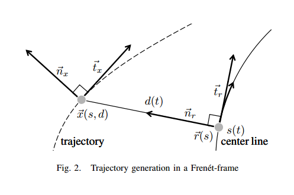

## Markdown基本语法
[网站](https://www.jianshu.com/p/191d1e21f7ed/)

### 一、标题
# 这是一级标题
## 这是二级标题
### 这是三级标题
#### 这是四级标题
##### 这是五级标题
###### 这是六级标题

### 二、字体
**这是加粗的文字**
*这是倾斜的文字*`
***这是斜体加粗的文字***
~~这是加删除线的文字~~


### 三、引用
>这是引用的内容
>>这是引用的内容
>>>>>>>>>>这是引用的内容


### 四、分割线
三个或者三个以上的 - 或者 * 都可以。

---
----
***
*****


### 五、图片



### 六、超链接

>[超链接名](超链接地址 "超链接title")
>title可加可不加

[简书](http://jianshu.com)
[百度](http://baidu.com)

### 七、列表
##### 无序列表
无序列表用 - + * 任何一种都可以
- 列表内容
+ 列表内容
* 列表内容


##### 有序列表
1. 列表内容
2. 列表内容
3. 列表内容
4. 注意：序号跟内容之间要有空格


##### 列表嵌套
1. 列表内容   
   2. 列表内容
   3. 列表内容


### 八、表格
表头|表头|表头
---|:--:|---:
内容|内容|内容
内容|内容|内容

第二行分割表头和内容。
- 有一个就行，为了对齐，多加了几个
文字默认居左
-两边加：表示文字居中
-右边加：表示文字居右
注：原生的语法两边都要用 | 包起来。此处省略


姓名|技能|排行
--|:--:|--:
刘备|哭|大哥
关羽|打|二哥
张飞|骂|三弟


### 九、代码

```cpp
  // 查表，获取输出控制量的校准值
  if (FLAGS_use_preview_speed_for_table) {
    calibration_value = control_interpolation_->Interpolate(
        std::make_pair(debug->preview_speed_reference(), acceleration_lookup));
  } else {
    calibration_value = control_interpolation_->Interpolate(
        std::make_pair(chassis_->speed_mps(), acceleration_lookup));
  }
```
---
```python
class Textbox:
    """Editing widget using the interior of a window object.
     Supports the following Emacs-like key bindings:

    Ctrl-A      Go to left edge of window.
    Ctrl-B      Cursor left, wrapping to previous line if appropriate.
    Ctrl-D      Delete character under cursor.

    Move operations do nothing if the cursor is at an edge where the movement
    is not possible.  The following synonyms are supported where possible:

    KEY_LEFT = Ctrl-B, KEY_RIGHT = Ctrl-F, KEY_UP = Ctrl-P, KEY_DOWN = Ctrl-N
    KEY_BACKSPACE = Ctrl-h
    """
    def __init__(self, win, insert_mode=False):
        self.win = win
        self.insert_mode = insert_mode
        self._update_max_yx()
        self.stripspaces = 1
        self.lastcmd = None
        win.keypad(1)

    def _update_max_yx(self):
        maxy, maxx = self.win.getmaxyx()
        self.maxy = maxy - 1
        self.maxx = maxx - 1

    def _end_of_line(self, y):
        """Go to the location of the first blank on the given line,
        returning the index of the last non-blank character."""
        self._update_max_yx()
        last = self.maxx
        while True:
            if curses.ascii.ascii(self.win.inch(y, last)) != curses.ascii.SP:
                last = min(self.maxx, last+1)
                break
            elif last == 0:
                break
            last = last - 1
        return last

```


### 十、流程图
```flow
st=>start: 开始
op=>operation: My Operation
cond=>condition: Yes or No?
e=>end
st->op->cond
cond(yes)->e
cond(no)->op
&```